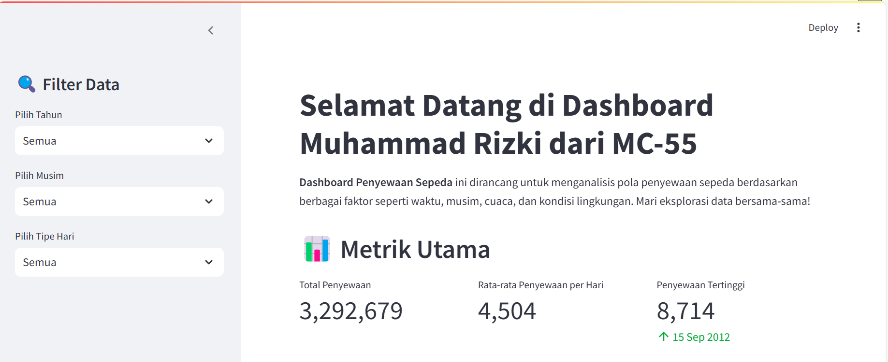
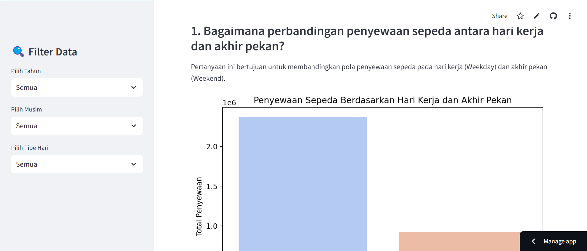
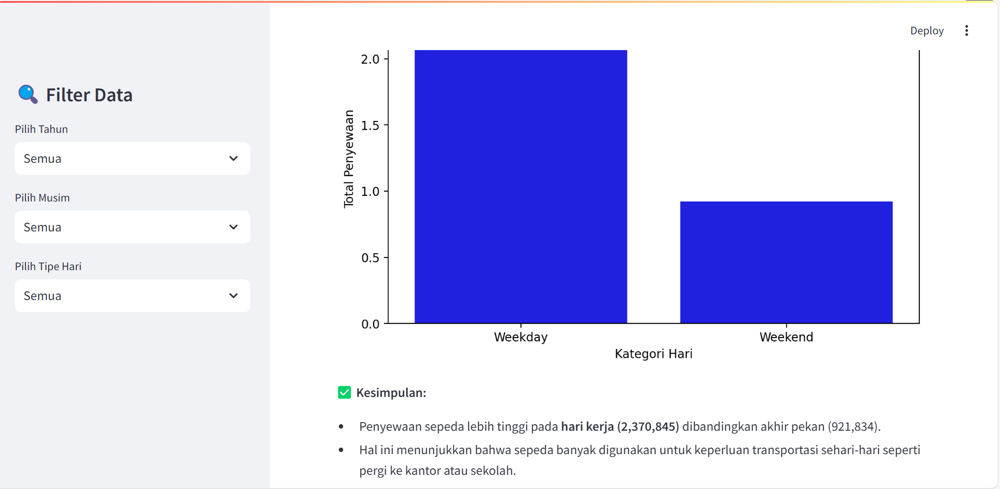
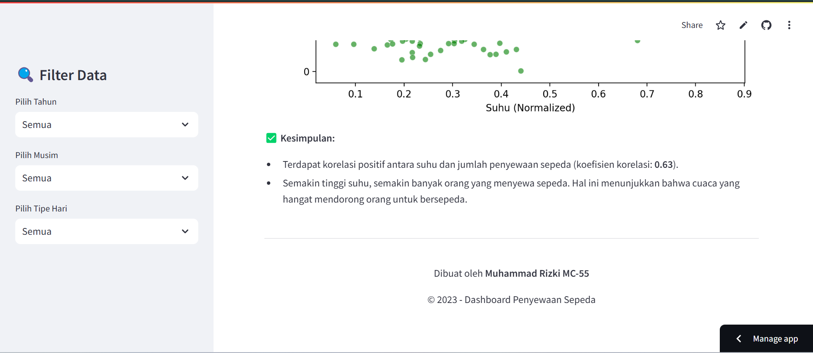

# 🚲 # Bike_Sharing_Dataset_Data_Analysis

Proyek ini dibuat untuk memenuhi sub-mission _Coding Camp by DBS Foundation 2025_.
Aplikasi ini menganalisis penyewaan sepeda pada hari kerja dan akhir pekan dan pengaruh suhu terhadap penyewaan sepeda

---

## 📌 Fitur Utama

✅ _Menganalisis Penyewaan sepeda pada hari kerja dan akhir pekan_  
✅ _Menganalisis Pengaruh suhu terhadap penyewaan sepeda_  
✅ _Visualisasi Data dengan Matplotlib & Seaborn_  
✅ _Dashboard Interaktif Menggunakan Streamlit_  
✅ _Filter data baik tahun, musim, dan hari (weekday atau weekend)_
✅ _Dapat Dijalankan Secara Lokal & Online (Streamlit Cloud)_

---

## 🚀 Cara Menjalankan Aplikasi

### 1️⃣ _Clone Repository_

bash
git clone https://github.com/MuhammadRizki1303/Bike_Sharing_Dataset_Data_Analysis
cd Bike_Sharing_Dataset_Data_Analysis

### 2️⃣ _Instalasi Dependensi_

Pastikan Python (versi 3.8 ke atas) sudah terinstal, lalu jalankan perintah berikut:
bash
pip install --upgrade pip
pip install -r requirements.txt

### 3️⃣ _Jalankan Aplikasi secara Lokal_

bash
streamlit run Dashboard/dashboard.py

Aplikasi akan terbuka di browser secara otomatis.

### 4️⃣ _Akses Aplikasi yang Telah Dideploy_

Aplikasi ini telah dideploy menggunakan streamlit cloud dan dapat diakses secara online melalui tautan berikut:
👉 [_Buka Aplikasi_](https://bikesharingdatasetdataanalysis-86a8vtkx3j9hxyuy6rxqjw.streamlit.app/)

---

## 📊 Teknologi yang Digunakan

- _Python_
- _Streamlit_
- _GitHub & Streamlit Cloud_

---

### 📊 Hasil Dari Dashboard

Berikut adalah dashboard dari analisis data penyewaan sepeda:

